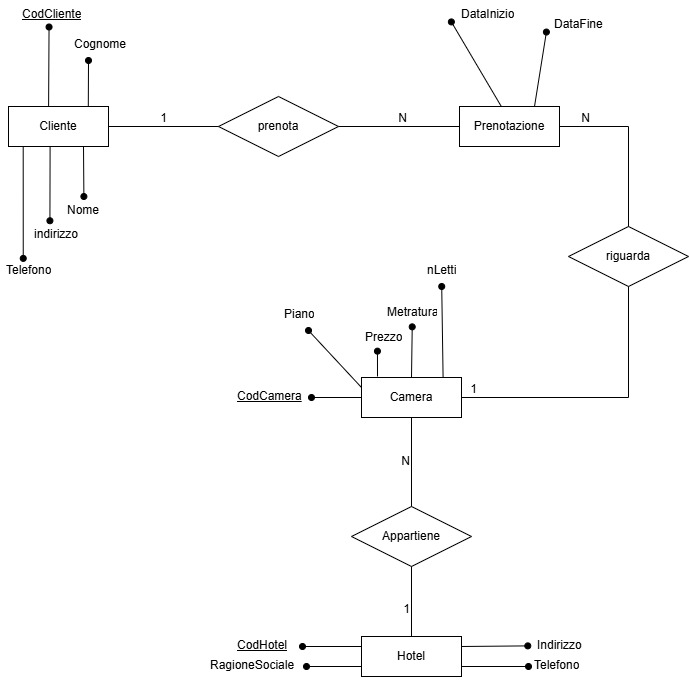
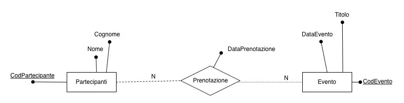

Un istituto scolastico fornisce un file CSV contenente informazioni su studenti, corsi e docenti. 
il csv è così strutturato:

nome_studente,cognome_studente,corso,docente,anno
Mario,Rossi,Informatica,Bianchi,2024
Luisa,Verdi,Matematica,Rossi,2024
Marco,Bianchi,Informatica,Bianchi,2024
Anna,Neri,Storia,Verdi,2023
...
crea il database e le tabelle

importa i dati dal CSV
crea le pagine per visualizzare:
le tabelle singolarmente
una ricerca per cognome studente
extra:
 mostra una query con JOIN (vista completa di tutte le tabelle)

Un’azienda di Hotellerie vuole realizzare un portale che permetta di gestire e visualizzare le prenotazioni dei propri clienti. Partendo dall’immagine qui sotto realizzare lo schema relazionale e  il database, facendo una connessione tramite PDO, e realizzando un’interfaccia che oltre a visualizzare le prenotazioni permetta anche le operazioni di CRUD (Create, REad, Update, Delete). Visualizzare i dati in una tabella.Visualizzare i dati in una tabella.

Un ente culturale vuole realizzare un sistema informativo per gestire la partecipazione dei cittadini agli eventi da loro organizzati. Il sistema permette di registrare i partecipanti, gli eventi e gestire le prenotazioni dei partecipanti agli eventi.
Allo stesso modo permette poi all’utente di visualizzare, inserire, modificare e cancellare le prenotazioni.
Partendo dallo schema ER fornito, realizzare lo schema relazionale, il DB, connettersi ad esse tramite PDO e costruire un’interfaccia per dare all’utente la possibilità di gestire le operazioni CRUD (Create, Read, Update, Delete). Visualizzare i dati in una tabella.

